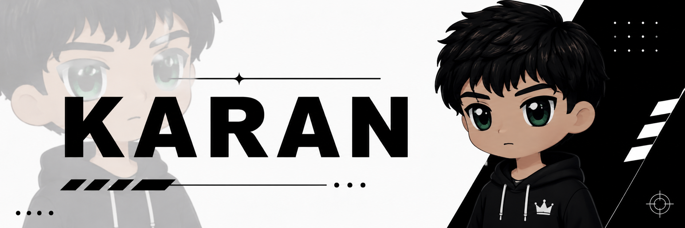

<div align="center">
  
</div>
<p align="center">  </p>

<p align="center">  </p>

<p align="center">  </p>
<table> <tr> <td width="16%"></td><td width="16%"></td><td width="16%"></td><td width="16%"></td><td width="16%"></td><td width="16%"></td> </tr> </table>
<p align="center">  </p>

 Hi, I'm 

 <div align="center">


</div>

---

# 🚀 ABOUT ME

<table> <tr> <td width="60%">

22 || Data Analyics || AI Engineer ||
Specialization:
  - Machine Learning
  - Data Science
  - Deep Learning
  - MLOps
  - Full Stack Development

Mission:
  Transform Data Into Intelligence

</td>

<td width="40%">


</td> </tr> </table>

---

# 🌌 CYBERPUNK TERMINAL


---

# ⚡ CONNECT TO THE NETWORK

<div align="center">

<a href="https://github.com/karanb786">

</a>

<a href="https://linkedin.com/in/karanbaiga">

</a>

<a href="mailto:kb410629@gmail.com">

</a>
<a href="https://www.instagram.com/kar_n.026/">
 
</a>
 
<a href="https://karanbaigaprofile.streamlit.app/">

</a>
 
<a href="https://x.com/Karanbaiga91439">

</a>
 
</div>

---

# 🚀 TECH ARSENAL

<table> <tr> <td width="40%">

## Languages


</td>

<td width="30%">

## Frameworks


</td>
<td width="50%">

## Tools


</td></tr> </table>


---

# 🤖 AI & DATA SCIENCE STACK

<div align="center">


</div>

<p align="left">  </p>

---
# 📊 GITHUB ANALYTICS

<div align="center">


</div>

---

# 💻 MOST USED LANGUAGES

<div align="center">


</div>

---

# 🏅 GITHUB TROPHIES

<div align="center">


</div>

---

# 📈 ACTIVITY GRAPH

<div align="center">


</div>

---

# 🐍 CONTRIBUTION SNAKE

<div align="center">


</div>

---

# 🌠 AI CORE STATUS

```yaml
Machine Learning: ███████████░ 90%

Data Science: ██████████░░░ 85%

Python: ███████████░ 90%

Full Stack: █████████░░░ 80%

MLOps: ████████░░░░ 75%

Cyber Security: ███████░░░░░ 70%
```


<div align="center">


<br><br>

### ⚡ POWERED BY AI • DATA • INNOVATION ⚡


</div>

